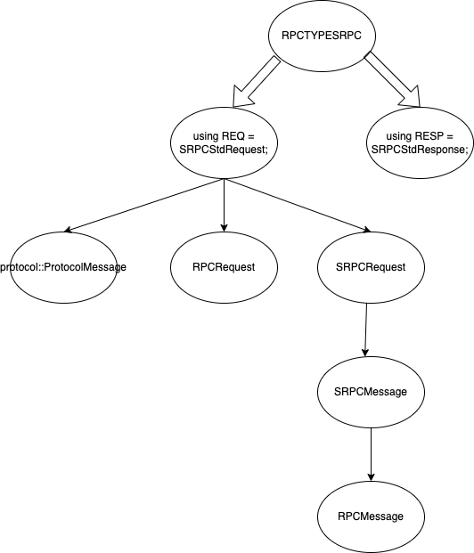

## srpc 初体验

```cpp
syntax = "proto3";//这里proto2和proto3都可以，srpc都支持

message EchoRequest {
    string message = 1;
    string name = 2;
};

message EchoResponse {
    string message = 1;
};

service Example {
    rpc Echo(EchoRequest) returns (EchoResponse);
};
```

有了这段代码，我们就可以为client和server生成消息对象和rpc基础代码，我们可以利用protobuf的编译器protoc生成。

protoc example.proto --cpp_out=./ --proto_path=./
srpc_generator protobuf ./example.proto ./


## 发送原理

client代码 :

```cpp
#include <stdio.h>
#include "example.srpc.h"

using namespace srpc;

int main()
{
    Example::SRPCClient client("127.0.0.1", 1412);
    EchoRequest req;
    req.set_message("Hello, srpc!");
    req.set_name("workflow");

    client.Echo(&req, [](EchoResponse *response, RPCContext *ctx) {
        if (ctx->success())
            printf("%s\n", response->DebugString().c_str());
        else
            printf("status[%d] error[%d] errmsg:%s\n",
                    ctx->get_status_code(), ctx->get_error(), ctx->get_errmsg());
    });

    getchar(); // press "Enter" to end.
    return 0;
}
```

```cpp
// src/rpc_define.h
using SRPCClient = RPCClient<RPCTYPESRPC>;
```

可以看出这个文件是特化各种协议的client和server的地方


## srpc协议

```cpp
struct RPCTYPESRPC
{
	using REQ = SRPCStdRequest;
	using RESP = SRPCStdResponse;
	static constexpr RPCDataType default_data_type = RPCDataProtobuf;

	static inline void server_reply_init(const REQ *req, RESP *resp)
	{
		resp->set_data_type(req->get_data_type());
	}
};
```

```cpp
// src/message/rpc_message_srpc.h
class SRPCStdRequest : public protocol::ProtocolMessage, public RPCRequest, public SRPCRequest
{
public:
	int encode(struct iovec vectors[], int max) override
	{
		return this->SRPCRequest::encode(vectors, max, this->size_limit);
	}

	int append(const void *buf, size_t *size) override
	{
		return this->SRPCRequest::append(buf, size, this->size_limit);
	}

public:
	bool serialize_meta() override
	{
		return this->SRPCRequest::serialize_meta();
	}

	bool deserialize_meta() override
	{
		return this->SRPCRequest::deserialize_meta();
	}

public:
	const std::string& get_service_name() const override
	{
		return this->SRPCRequest::get_service_name();
	}

	const std::string& get_method_name() const override
	{
		return this->SRPCRequest::get_method_name();
	}

	void set_service_name(const std::string& service_name) override
	{
		return this->SRPCRequest::set_service_name(service_name);
	}

	void set_method_name(const std::string& method_name) override
	{
		return this->SRPCRequest::set_method_name(method_name);
	}

	bool set_meta_module_data(const RPCModuleData& data) override
	{
		return this->SRPCMessage::set_meta_module_data(data);
	}

	bool get_meta_module_data(RPCModuleData& data) const override
	{
		return this->SRPCMessage::get_meta_module_data(data);
	}

public:
	SRPCStdRequest() { this->size_limit = RPC_BODY_SIZE_LIMIT; }
};
```

这里有两个重点，第一个是多继承

```cpp
class SRPCStdRequest : public protocol::ProtocolMessage, public RPCRequest, public SRPCRequest
```

从接口看的出来，这个class只是父类功能的一个wrapper

第一个继承的是`protocol::ProtocolMessage`, 这个熟悉workflow就知道，当定义一个协议的时候，需要继承此类去提供序列化和反序列化方法，

可以见 ： https://github.com/sogou/workflow/blob/master/docs/tutorial-10-user_defined_protocol.md 

第二个就是RPCRequest，看名字就知道应该是个纯虚的基类

```cpp
// src/message/rpc_message.h 
class RPCRequest
{
public:
	virtual bool serialize_meta() = 0;
	virtual bool deserialize_meta() = 0;

	virtual const std::string& get_service_name() const = 0;
	virtual const std::string& get_method_name() const = 0;

	virtual void set_service_name(const std::string& service_name) = 0;
	virtual void set_method_name(const std::string& method_name) = 0;

	virtual bool get_meta_module_data(RPCModuleData& data) const = 0;
	virtual bool set_meta_module_data(const RPCModuleData& data) = 0;

	virtual void set_seqid(long long seqid) {}
};
```

果然是，我们先忽律具体的方法细节，看看协议的继承结构

```cpp
// src/message/rpc_message_srpc.h
class SRPCRequest : public SRPCMessage
{
public:
	const std::string& get_service_name() const;
	const std::string& get_method_name() const;

	void set_service_name(const std::string& service_name);
	void set_method_name(const std::string& method_name);
};
```

```cpp
// src/message/rpc_message_srpc.h
// define srpc protocol
class SRPCMessage : public RPCMessage
{
public:
	SRPCMessage();
	virtual ~SRPCMessage();

	int encode(struct iovec vectors[], int max, size_t size_limit);
	int append(const void *buf, size_t *size, size_t size_limit);

	bool serialize_meta();
	bool deserialize_meta();

	int get_compress_type() const override;
	int get_data_type() const override;

	void set_compress_type(int type) override;
	void set_data_type(int type) override;

	void set_attachment_nocopy(const char *attachment, size_t len);
	bool get_attachment_nocopy(const char **attachment, size_t *len) const;

	bool set_meta_module_data(const RPCModuleData& data) override;
	bool get_meta_module_data(RPCModuleData& data) const override;

public:
	using RPCMessage::serialize;
	using RPCMessage::deserialize;
	int serialize(const ProtobufIDLMessage *pb_msg) override;
	int deserialize(ProtobufIDLMessage *pb_msg) override;
	int serialize(const ThriftIDLMessage *thrift_msg) override;
	int deserialize(ThriftIDLMessage *thrift_msg) override;

	int compress() override;
	int decompress() override;

public:
	RPCBuffer *get_buffer() const { return this->buf; }
	size_t get_message_len() const { return this->message_len; }
	void set_message_len(size_t len) { this->message_len = len; }

protected:
	void init_meta();

	// "SRPC" + META_LEN + MESSAGE_LEN + RESERVED
	char header[SRPC_HEADER_SIZE];
	RPCBuffer *buf;
	char *meta_buf;
	size_t nreceived;
	size_t meta_len;
	size_t message_len;
	ProtobufIDLMessage *meta;
};
```

```cpp
// src/message/rpc_message.h 
class RPCMessage
{
public:
	virtual void set_data_type(int type) = 0;
	virtual void set_compress_type(int type) = 0;
	virtual int get_compress_type() const = 0;
	virtual int get_data_type() const = 0;

public:
	//return RPCStatus
	virtual int compress() = 0;
	virtual int decompress() = 0;
	virtual bool get_meta_module_data(RPCModuleData& data) const = 0;
	virtual bool set_meta_module_data(const RPCModuleData& data) = 0;

	virtual bool set_http_header(const std::string& name,
								 const std::string& value)
	{
		return false;
	}

	virtual bool add_http_header(const std::string& name,
								 const std::string& value)
	{
		return false;
	}

	virtual bool get_http_header(const std::string& name,
								 std::string& value) const
	{
		return false;
	}

	virtual void set_json_add_whitespace(bool on);
	virtual bool get_json_add_whitespace() const;
	virtual void set_json_enums_as_ints(bool on);
	virtual bool get_json_enums_as_ints() const;
	virtual void set_json_preserve_names(bool on);
	virtual bool get_json_preserve_names() const;
	virtual void set_json_print_primitive(bool on);
	virtual bool get_json_print_primitive() const;

public:
	//pb
	virtual int serialize(const ProtobufIDLMessage *idl_msg)
	{
		return RPCStatusIDLSerializeNotSupported;
	}

	virtual int deserialize(ProtobufIDLMessage *idl_msg)
	{
		return RPCStatusIDLDeserializeNotSupported;
	}

public:
	//thrift
	virtual int serialize(const ThriftIDLMessage *idl_msg)
	{
		return RPCStatusIDLSerializeNotSupported;
	}

	virtual int deserialize(ThriftIDLMessage *idl_msg)
	{
		return RPCStatusIDLDeserializeNotSupported;
	}

public:
	RPCMessage() { this->flags = 0; }

protected:
	uint32_t flags;
};
```

至于为何要实现这种继承，得从多个不同协议实现入手，来看看各个层级之间的职责和差异。这放到后面再来讲。


